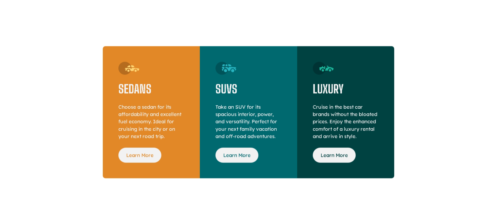

# Frontend Mentor - 3-column preview card component solution

This is my solution to the [3-column preview card component challenge on Frontend Mentor](https://www.frontendmentor.io/challenges/3column-preview-card-component-pH92eAR2-). This challenge helped me practice responsive layouts, semantic HTML, and component design using Tailwind CSS.

---

## Table of Contents

- [Frontend Mentor - 3-column preview card component solution](#frontend-mentor---3-column-preview-card-component-solution)
  - [Table of Contents](#table-of-contents)
  - [Overview](#overview)
    - [The Challenge](#the-challenge)
    - [Screenshot](#screenshot)
    - [Links](#links)
  - [My Process](#my-process)
    - [Built With](#built-with)
    - [What I Learned](#what-i-learned)
    - [Continued Development](#continued-development)
    - [Useful Resources](#useful-resources)
  - [Author](#author)

---

## Overview

### The Challenge

Users should be able to:

- View the optimal layout depending on their device's screen size
- See hover states for interactive buttons

---

### Screenshot



---

### Links

- [Live Site URL](https://3-column-preview-card-component-sable-seven.vercel.app/)
- [Solution on Frontend Mentor](https://www.frontendmentor.io/solutions/3-column-preview-card-component---tailwindcss-PBVqjfA8iG)

---

## My Process

### Built With

- Semantic HTML5
- [Tailwind CSS](https://tailwindcss.com/) – Utility-first framework for styling
- Mobile-first workflow
- CSS Grid and Flexbox layout

---

### What I Learned

This project helped me sharpen my Tailwind utility class usage and understand how to:

- Apply responsive grid layouts using `grid-cols-3` on medium screens and above
- Use custom fonts like **Lexend Deca** and **Big Shoulders Display**
- Style interactive buttons with Tailwind's hover and ring utilities
- Build consistent component cards with utility classes

Example button styling I liked:

```html
<button class="px-6 py-3 rounded-full bg-white text-primary-orange hover:bg-transparent hover:text-white hover:ring-2 hover:ring-white">
  Learn More
</button>
```

---

### Continued Development

Next, I want to focus on:

- Improving accessibility (ARIA labels, better focus handling)
- Using Tailwind's `@layer` to organize styles
- Building reusable card components across projects

---

### Useful Resources

- [Tailwind CSS Documentation](https://tailwindcss.com/docs) – Great reference while building
- [Fontsource](https://fontsource.org/) – Helpful for embedding Google fonts locally (for future projects)
- [Frontend Mentor Slack Community](https://frontendmentor.io/slack) – Great for feedback and support

---

## Author

- Website – [iwaola.me](https://iwaola.me)
- Frontend Mentor – [@fawaziwalewa](https://www.frontendmentor.io/profile/fawaziwalewa)
- Twitter – [@IwalewaFawaz](https://twitter.com/IwalewaFawaz)
